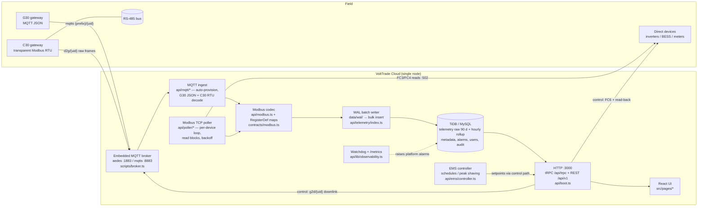

# System architecture (D9)

VoltTrade Cloud — single-node app (Hono + tRPC on Node, React/Vite UI) with
an embedded MQTT broker, a Modbus TCP poller, and MySQL/TiDB (or
TimescaleDB) storage. Everything below names the code that implements it.

## Ingest paths

- **G30 (MQTT JSON):** gateways publish parsed JSON to `{prefix}/{uid}`;
  unknown gateways are auto-provisioned (disable with
  `MQTT_AUTO_PROVISION=0`). Decoded samples go to `persistTelemetry`.
- **C30 (transparent RTU):** raw Modbus RTU frames ride `d2g/{uid}` up and
  `g2d/{uid}` down. The ingest loop issues reads per the device's register
  map and decodes with the shared codec (`api/modbus.ts`).
- **Modbus TCP poller (`api/poller/service.ts`):** for direct-Ethernet
  devices — one TCP client per host:port, unit-id addressing per device,
  registers grouped into read blocks (same FC, gap ≤ 8, ≤ 120 words),
  per-device poll interval with exponential backoff on transport errors.
- **Register maps** are device profiles (`device_profiles` table; seeded by
  `scripts/seed-profiles.ts` + `scripts/seed-sunspec.ts`), editable in the
  UI. Keys are canonical metric names (`activePowerKw`, `socPercent`, …).

All paths converge on `persistTelemetry` → liveness tracking, alarm-rule
evaluation per sample, and the WAL batch writer.

## Storage

- **WAL batch writer** (`api/telemetry/index.ts`): rows append to
  `data/wal/pending.jsonl` and flush in bulk; segments replay on boot
  (at-least-once — boundary duplicates harmless, reports use counter
  deltas). Rows that exhaust retries surface in
  `enertrek_telemetry_rows_failed_total`.
- **MySQL/TiDB store** (default): raw `telemetry` rows kept
  `TELEMETRY_RAW_DAYS` (default **90**); an hourly rollup job aggregates
  closed hours into `telemetry_hourly` (counter-reset-safe) and prunes raw
  rows. Reports for days beyond the cutoff read the rollup.
- **TimescaleDB store** (optional, `TIMESCALE_URL`): native continuous
  aggregates + retention policies (`db/timescale/001_init.sql`).

## APIs & UI

- **tRPC** (`/api/trpc/*`) — the UI's API; optional `API_TOKEN` bearer
  guard. RBAC roles admin/operator/viewer (`api/middleware.ts`).
- **REST v1** (`/api/v1/*`) — read-only external API, Bearer API keys
  (`docs/api-v1.md`).
- **React UI** (`src/pages/*`) — Dashboard, Gateways, Devices (register-map
  viewer, test-connection), Alarms + rules, Reports, Settings
  (users, API keys, notification channels, EMS schedules).

## Control path

`api/control/execute.ts` — setpoints are whitelisted per model
(`device_profiles.controllable`), range-clamped, RBAC-gated
(operator/admin) and audited (every attempt, success and failure, lands in
`commands` with userId). Direct-TCP devices: FC6 write **+ read-back
verification** on a throwaway connection. C30 bus devices: FC6 frame via
the `g2d/{uid}` downlink (asynchronous, status "sent", no read-back). G30:
no downlink — control rejected. The EMS controller
(`api/ems/controller.ts`, BESS schedules/peak shaving) issues setpoints
through this same path. Future protocols plug into
`api/protocols/adapter.ts` (see `docs/protocols.md`).

## Observability & resilience

- **`GET /metrics`** — Prometheus counters/gauges: HTTP requests,
  telemetry rows written/failed, poller stats, MQTT status
  (`api/lib/observability.ts`).
- **Platform watchdog** — ticks every 60 s (after a 2 min startup grace):
  raises critical alarms `platformWatchdogMqtt` (broker disconnected) and
  `platformWatchdogPoller` (no successful poll in 5 min), auto-resolves on
  recovery. Feeds the same alarm/notification/escalation pipeline as
  device alarms.
- **Audit** — tRPC mutations logged; control attempts in `commands`;
  request ids (`x-request-id`) on every API call.
- **Backup/DR** — `scripts/backup-db.ts` (all 15 tables, manifest-verified)
  and `scripts/restore-db.ts`; see `docs/runbook-backup-dr.md`.
- **TLS** — mqtts for gateways, HTTPS via reverse proxy for the app;
  `docs/tls.md`.

## Operational docs

`docs/commissioning.md` (site onboarding) · `docs/runbook-operators.md`
(incidents) · `docs/sla.md` (service levels) · `docs/protocols.md`
(protocol roadmap: IEC 61850, DNP3, OCPP, M-Bus).
