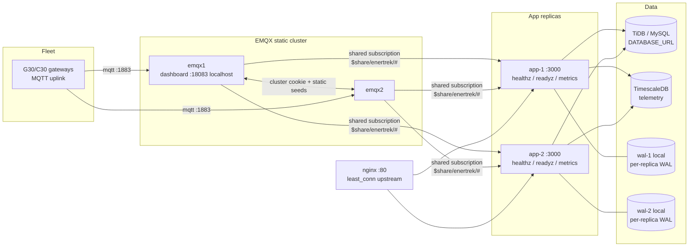

# High availability (v8/D6)

Two stateless-ish app replicas behind nginx, a 2-node EMQX cluster for the
gateway fleet, TiDB (or managed MySQL) for metadata, TimescaleDB for
telemetry. The app connects to the broker as a **client** via `MQTT_URL`;
when unset it uses the local dev broker (`scripts/broker.ts`) — there is no
embedded broker inside the app process.

## Architecture



## Health endpoints

| Endpoint   | Purpose   | Result |
|------------|-----------|--------|
| `/healthz` | liveness  | 200 always — process is up |
| `/readyz`  | readiness | 200 when DB ping (`SELECT 1`) **and** broker connected; otherwise **503** with `{ reason, components: { db, broker, brokerMode } }` |

Both are unauthenticated and live next to `/metrics`, outside `/api/trpc`
auth. The compose healthcheck gates nginx `depends_on: service_healthy` on
`/readyz`; nginx itself evicts failing replicas via `max_fails`.

## Zero-downtime rolling deploy

One replica at a time — nginx keeps serving through the other:

```bash
docker compose -f docker-compose.prod.yml up -d --no-deps --build app-1
# wait for healthy:  docker compose -f docker-compose.prod.yml ps
docker compose -f docker-compose.prod.yml up -d --no-deps --build app-2
```

Blue-green alternative: keep the old image tag running as a third temporary
upstream, switch `deploy/nginx.conf`, reload nginx (`nginx -s reload`), then
drain. Schema migrations are **additive-only** (see `db/migrations`), so old
and new code can coexist against the same DB during the roll.

## State audit — what lives where

| State | Location | Replica-safe? |
|---|---|---|
| Sessions (cookies) | `sessions` table in **DB** | yes — any replica serves any session |
| Session/user cache | DB + 60 s **RAM** cache per replica | yes — writes call `evictUserCache()`; worst case 60 s staleness on the other replica |
| Login lockout | `login_attempts` table + per-replica cache | yes — a lockout earned on one replica is enforced on the other |
| Pending MFA challenge | `mfa_pending` table | yes — any replica can complete a challenge another issued |
| Alarm hysteresis | `alarm_breach_state` table + per-replica cache | yes — transitions are written; only the cache is per replica |
| API keys | DB + RAM cache | yes — `evictApiKeyCache()` on revoke/create |
| Telemetry WAL | **local disk per replica** (`TELEMETRY_WAL_DIR`) | per-replica by design — **never share the volume** (append/offset log; two writers corrupt offsets and double-replay). Replicas write disjoint batches because ingestion is shared-subscription balanced |
| Telemetry data | TimescaleDB | yes |
| OTA job state | `ota_jobs` in DB | yes (see below) |
| EMS schedules/config | DB | yes (see below) |
| Report schedules | DB | yes (see below) |
| Report artifacts | `data/reports/` local disk per replica | files are per-run artifacts; email is the delivery path |
| MQTT broker state | EMQX cluster | 2-node static cluster, shared cookie |

## Shared state (was per-process)

Three structures used to live in module-level Maps and behaved incorrectly with
more than one replica. All three now live in the database:

| Was | Table | Why it mattered |
| --- | --- | --- |
| Login lockout counters | `login_attempts` | Each replica counted independently, so the brute-force budget was five attempts **per replica** rather than five in total — the limit scaled with the fleet |
| Pending MFA challenges | `mfa_pending` | A challenge issued by one replica did not exist on the other, so a correct second factor was rejected whenever the load balancer moved the request |
| Alarm hysteresis | `alarm_breach_state` | MQTT ingestion is deliberately not leased, so both replicas evaluate the same rules. Separate state meant a breach could be raised twice or a clear missed |

The map stays in front of each as a per-replica cache; the table is the
authority, and only transitions are written, so the ingest hot path does not
touch the database on every sample. A database failure degrades each to the
previous per-replica behaviour rather than failing the request.

`alarm_breach_state.since` also records when a condition STARTED, which is what
alarm duration ("breached for N minutes") needs and what a restart used to
throw away.

## Single-writer leases

Loops that command plant hold a lease in the `leader_leases` table before
acting (`api/lib/leader.ts`). Exactly one replica wins; the others skip the
tick. The lease is renewed every tick and expires after 90 s, so a replica that
dies hands over rather than blocking control indefinitely.

The database is already a hard dependency, so this needs no Redis. It
generalises the conditional UPDATE the report scheduler was already using.

| Lease | Held by |
| --- | --- |
| `ems-controller` | the EMS tick (schedules, plans, peak shaving, watchdog refresh) |
| `ota-manager` | OTA dispatch and the ack-timeout sweep |
| `modbus-poller` | the direct-TCP poll loop |

A failure to reach the database means **not** the leader. Failing closed is
correct: each of these loops reads its instructions from that same database, so
it has nothing useful to do while the database is unreachable.

`LEADER_LEASES=off` disables the mechanism entirely for single-instance
deployments, where the round trip per tick buys nothing.

Not leased, deliberately: **MQTT ingestion**, which is balanced across replicas
by the shared subscription and is supposed to run everywhere; and the **report
scheduler**, which already claims each period atomically.

## Duplicate-loop analysis (2 replicas)

All background loops run on **every** replica. Effects and guards:

| Loop | Duplicate effect | Guard |
|---|---|---|
| **MQTT ingestion** | Two clients subscribing `#` would both receive every uplink → double telemetry rows | **Shared subscription**: when `MQTT_URL` is set the app subscribes `$share/enertrek/#` — EMQX delivers each message to exactly one group member. (Embedded dev broker aedes lacks `$share`, so dev keeps plain `#`; set `MQTT_SHARED_SUB=0` for external brokers without `$share` support — then replicas each get every message, i.e. run a single replica.) |
| **EMS controller** | Both replicas evaluate the same schedules and could write the same setpoint twice | **Leased** (`api/lib/leader.ts`, lease `ems-controller`): exactly one replica runs the tick. A replica that dies stops renewing and another takes over once the lease lapses, so control moves rather than stopping. Previously this relied on FC6 writes being value-idempotent, which made a duplicate merely cosmetic — but the in-RAM 5-minute dedup was per replica, so the guarantee was weaker than it looked. |
| **OTA manager** | Both replicas dispatch the same pending job → two publishes of the same jobId | **Leased** (`ota-manager`). The ack path was already tolerant — `handleOtaAck` only transitions jobs still in `sent` — but the timeout sweep could double-increment `attempts` and fail a job an attempt early. |
| **Report scheduler** | Both replicas pass `isDue` in the same minute → **duplicate email** | **Implemented guard**: before generating, the loop claims the period with an atomic conditional `UPDATE report_schedules SET last_run_at = <now> WHERE id = ? AND (last_run_at IS NULL OR last_run_at < <period_start>)`. TiDB row-locking lets exactly one replica win; the loser sees 0 affected rows and skips. At-most-once per period: if the winner crashes mid-send, that period's email is lost rather than doubled. |
| **Retention/rollup** | Both replicas run the hourly rollup + raw retention | Rollup upserts hourly aggregates (`INSERT … ON DUPLICATE KEY UPDATE`) and retention deletes by time window — both are naturally idempotent. |
| **Watchdog / alarm escalation** | Duplicate alert checks / notification attempts | Alarm transitions are status-guarded in DB; escalation mail may duplicate in the worst case (same as a retry). |
| **Modbus TCP poller** | Two replicas polling the same direct-TCP device → **double telemetry rows** | **Leased** (`modbus-poller`). A replica that does not hold the lease tears down its per-device timers and stands by. This used to be a manual limit requiring `POLLER_ENABLED=0` on the second replica; that variable still works as a hard override. |

## Failover drills

Executed 2026-08-13 (audit wave 3) — full evidence in
`docs/DRILL-EVIDENCE.md`:

- **Broker kill drill**: `pkill` on the embedded dev broker → watchdog
  restarted it in 20 s, `/readyz` back to 200 in ≤ 59 s, sims + app MQTT
  client reconnected, **0 telemetry rows lost**, ~60 duplicate rows from
  at-least-once redelivery (documented tolerance).
- **Backup → scratch restore drill**: `scripts/dr/backup-restore-drill.ts`,
  all 7 audit tables restored into `volttrade_dr_drill` and checksum-verified
  (backup 11.4 s, restore 2.8 s), scratch DB dropped afterwards.
- Organic same-day evidence: the watchdog recovered the whole stack after a
  full outage at 10:19Z; a second outage (11:08Z–12:21Z) showed the watchdog
  itself has no supervisor — run it under systemd/cron in real deployments.

Drills repeat quarterly (next: 2026-11-13), rotating the killed component.

## Honest limits

- **Metadata DB**: a single TiDB Serverless endpoint (private link) is a
  single point of failure; the app degrades to 503 on `/readyz` but nginx
  still routes to replicas (they return API errors, static UI keeps loading).
  Multi-AZ TiDB or managed MySQL HA is out of scope.
- **Broker endpoint for gateways**: the fleet points at one DNS name;
  put a TCP LB in front of emqx1/emqx2 (or use EMQX's built-in LB) for true
  broker HA — the compose file exposes 1883 on emqx1 only for clarity.
- **Broker migration**: moving an existing deployment from the embedded dev
  broker to external EMQX is a config change (`MQTT_URL`, repoint gateways)
  — no data migration; retained downlink commands should be re-published
  (`replayRetainedDownlinks` only replays from the broker the app is
  connected to).
- **Poller duplication** (above) and **EMS duplicate-audit** (above) are the
  known cosmetic/edge artifacts of multi-replica operation.
